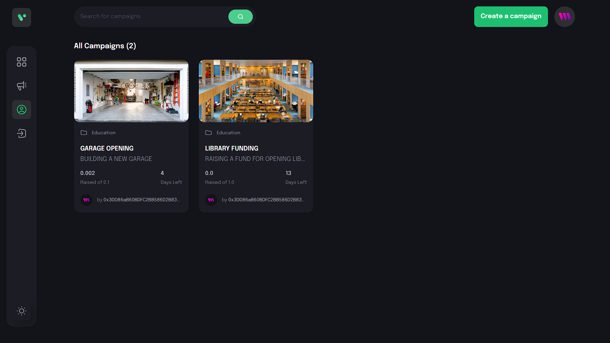
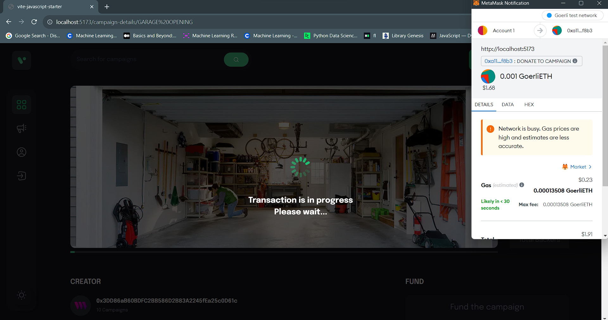
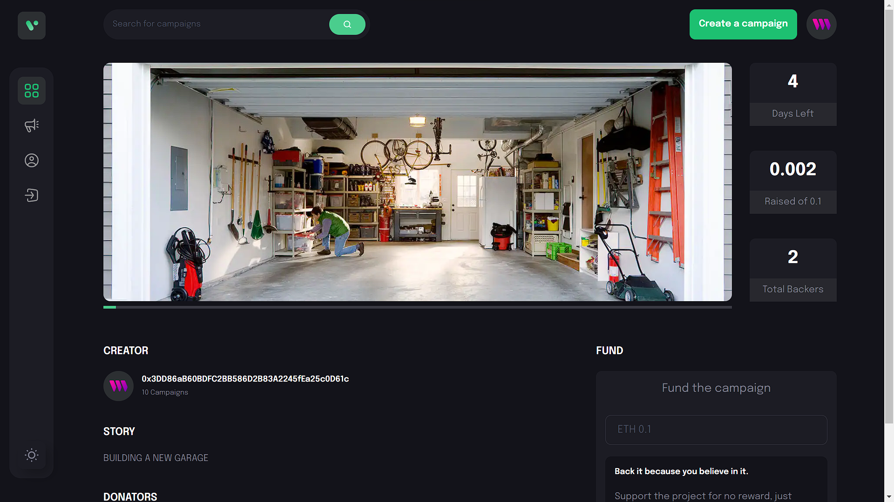
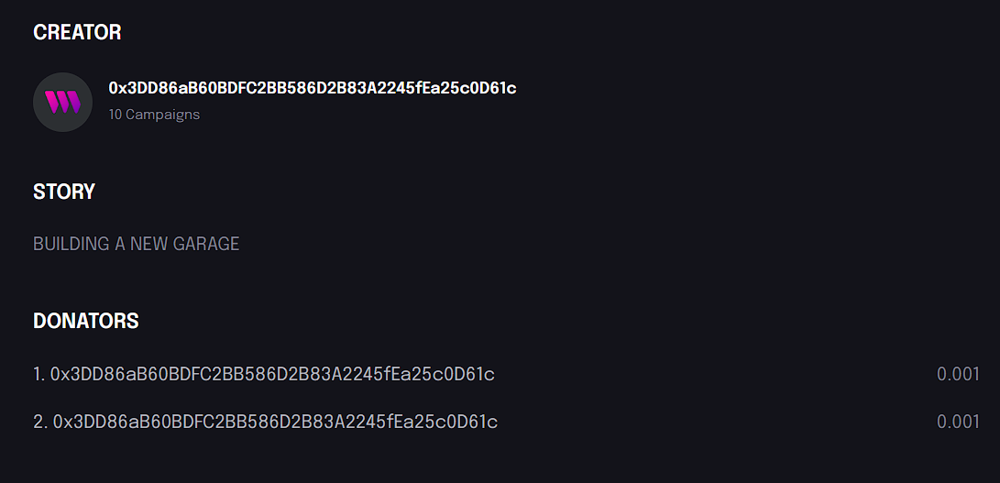

# Crowdfunding Platform with Web3 and Thirdweb SDK

Welcome to the Crowdfunding Platform repository! This project aims to provide a decentralized crowdfunding solution using Web3 technology and the Thirdweb SDK. The frontend is built using React.js with Vite as the build tool and Tailwind CSS for styling.

## Features

- **Decentralized Crowdfunding:** Leverage the power of blockchain and Web3 to create a trustless and transparent crowdfunding platform.
- **Thirdweb SDK Integration:** Utilize the Thirdweb SDK to interact with decentralized storage and other features on the Thirdweb network.
- **Modern Frontend:** The frontend is developed using React.js and Vite for a fast and optimized development experience.
- **Responsive Design:** The UI is designed to be responsive and user-friendly across various devices and screen sizes using Tailwind CSS.

## Demo Images






## Prerequisites

- Node.js (>= 14.x)
- Yarn or npm (Yarn recommended for package management)

## Getting Started

1. Clone this repository:

   ```bash
   git clone https://github.com/chanakyakapoor/web-3_crowdfunding_platform.git

2. Navigate to project Directory:
    ```bash
    cd web-3_crowdfunding_platform

3. Install dependencies using Yarn or npm:
    ```bash
    yarn install 
    ```
    or
    ```
    npm install
    ```

4. Start the Development Server:
    ```bash
    yarn dev 
    ```
    or
    ```
    npm run dev
    ```

## Acknowledgements

Thanks to the Web3 community and the Thirdweb SDK team for their amazing tools and resources.
This project was bootstrapped using the Vite template for React.js with TypeScript and Tailwind CSS.


